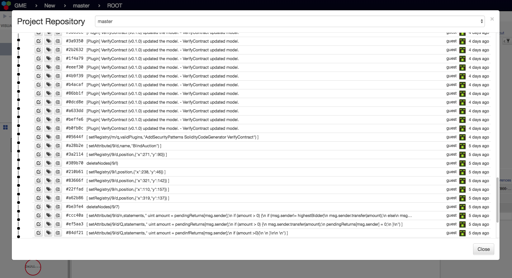
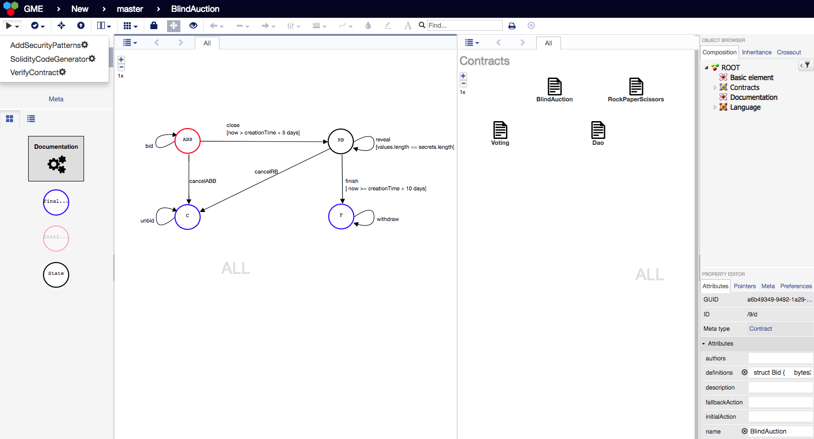
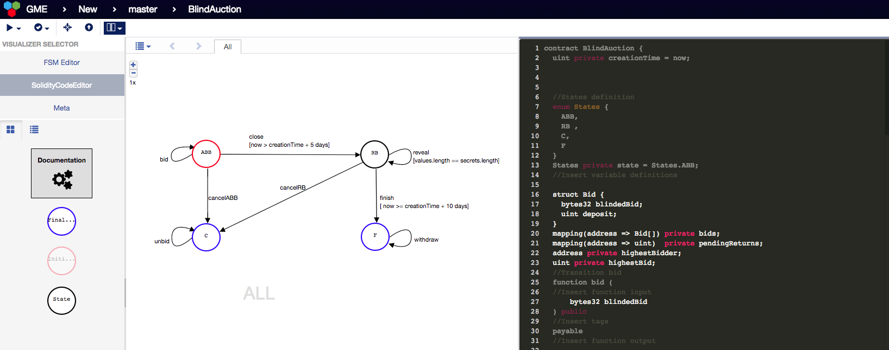
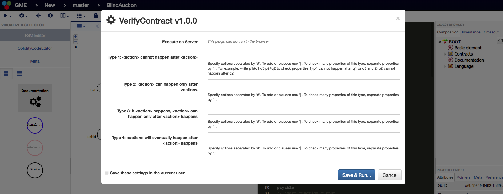
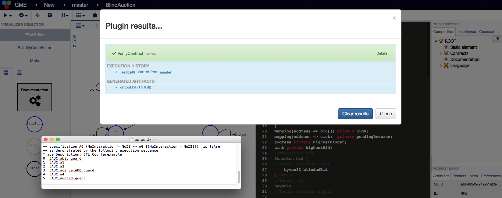

# SmartContracts - The VeriSolid Framework

## Contents
1. [Features of VeriSolid](#features)
2. [How to install VeriSolid?](#how-to-install-verisolid)

### Features

* Collaborative, automatically versioned web-based development.



* Dedicated Transition System Editors. In the upper left corner you can see the plugins offered by the tool for: 1) adding functionality through design patterns; 2) generating Solidity code and 3) verifying smart contracts.



* Fully integrated Solidity code development.



* Templates for writing security properties in natural language when running the VerifyContract plugin. If no property is specified the tool still verifies deadlock-freedom. We have fully integrated the BIP and NuSMV verification tools.



* The verification results are returned to the user. If a security property is not true, VeriSolid returns a counter-example that invalidates the property.



* Embeddable documentation at every level of the model.

## How to install VeriSolid?

First, install the following:
- [NodeJS](https://nodejs.org/en/download/) (v4.x.x recommended)
- [MongoDB](https://www.mongodb.com/download-center#production)

To clone the repository, first install (if necessary):
- [Git](https://git-scm.com/downloads)

and then clone the repository in your preferred directory, for example:
```
cd /home/$USER
git clone https://github.com/VeriSolid/smart-contracts.git
```
This makes the 'project root' for the git repo `/home/$USER/smart-contracts`.

Install packages with npm in the project root (`smart-contracts`):
```
cd /home/$USER/smart-contracts
npm install
npm install webgme
npm install -g bower
bower install
```
Start mongodb locally by running the `mongod` executable in your mongodb installation (you may need to create a `data` directory or set `--dbpath`). For example:
```
cd /home/$USER
mkdir sc_data
mongod --dbpath ./sc_data
```
wait until you see a line that says "[initandlisten] waiting for connections on port 27017".

Then, in a new terminal window, run `npm start` from the project root (`smart-contracts`) to start. For example:
```
cd /home/$USER/smart-contracts
npm start
```

After the webgme server is up and there are no error messages in the console, open a valid address in the browser to start using VeriSolid. The default is http://127.0.0.1:8888/, you should see all valid addresses in the console.

Click `Create New…` to create a new project.
After entering a project name of your choice, import the seed `SC` to start working with VeriSolid!
